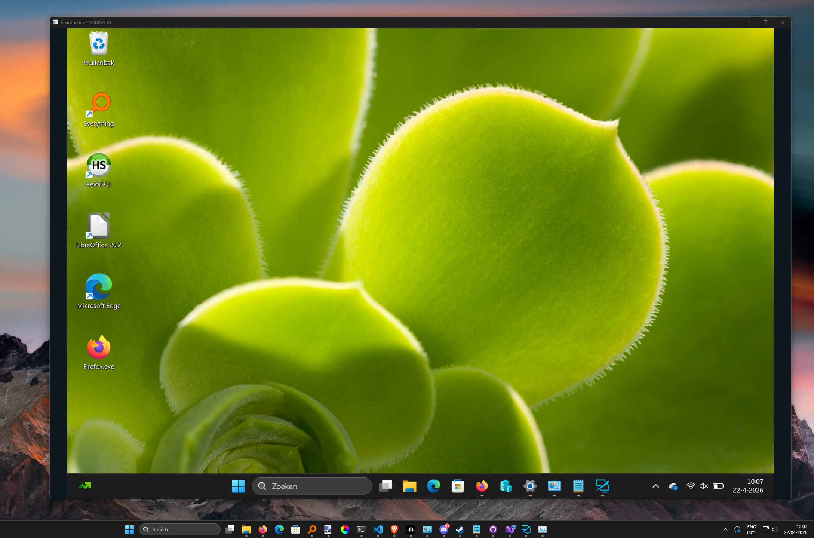
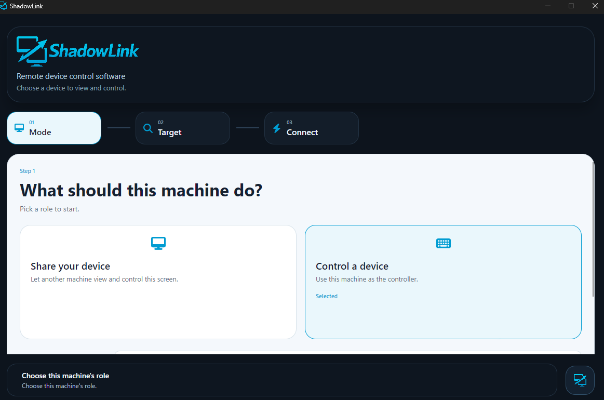
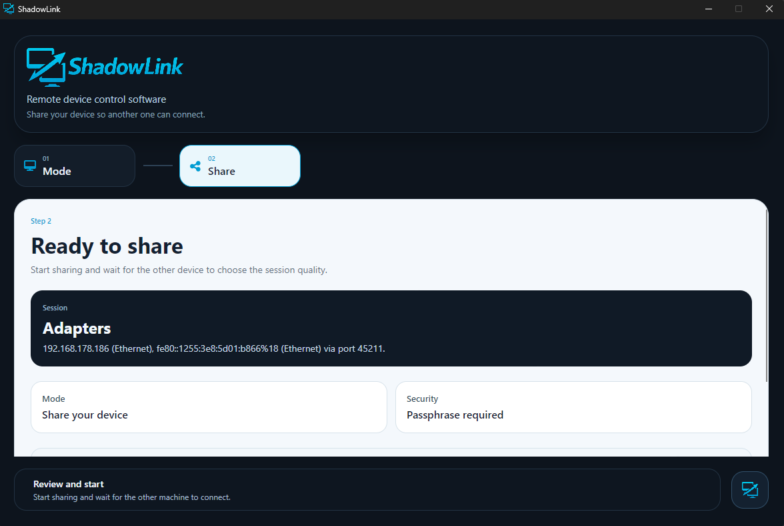
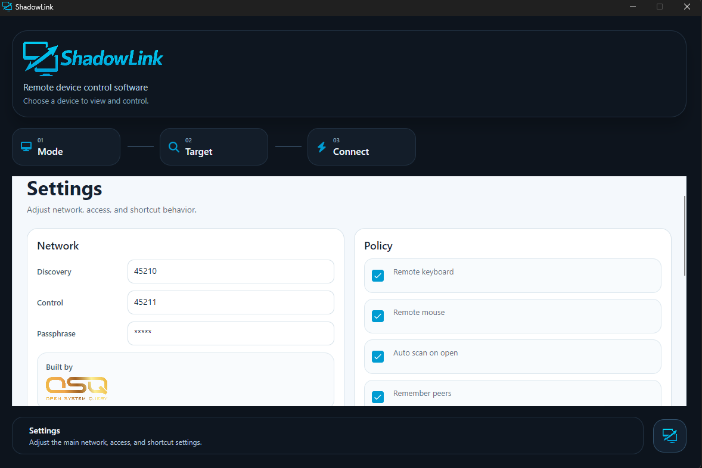

# ShadowLink

Remote device control software

ShadowLink is a cross-platform desktop application for viewing and controlling another machine through a focused, operator-friendly workflow. It combines device discovery, direct connection support, screen sharing, and remote input into a single desktop client for Windows, macOS, and Linux.

## Overview

ShadowLink is built around two core roles:

- share a device so another machine can connect
- control a device from a dedicated viewer

The application provides a guided session flow, nearby device discovery, direct address connection, configurable viewing and streaming behavior, and a consistent desktop interface across platforms.

## Highlights

- Cross-platform desktop client for Windows, macOS, and Linux
- Remote viewing and device control in a single application
- Nearby discovery for local devices and direct address connection support
- Guided share and control workflow designed for fast session setup
- Configurable networking, security, viewing, and streaming settings

## Screenshots

<table>
  <tr>
    <td align="center" valign="top">
      
       
      Control workflow
    </td>
    <td align="center" valign="top">
      
       
      Share workflow
    </td>
  </tr>
  <tr>
    <td colspan="2" align="center" valign="top">
      
       
      Settings
    </td>
  </tr>
</table>

## Repository

The current repository contains the desktop client source in [`Source/`](Source).

## License

ShadowLink is licensed under the [MIT License](LICENSE).
